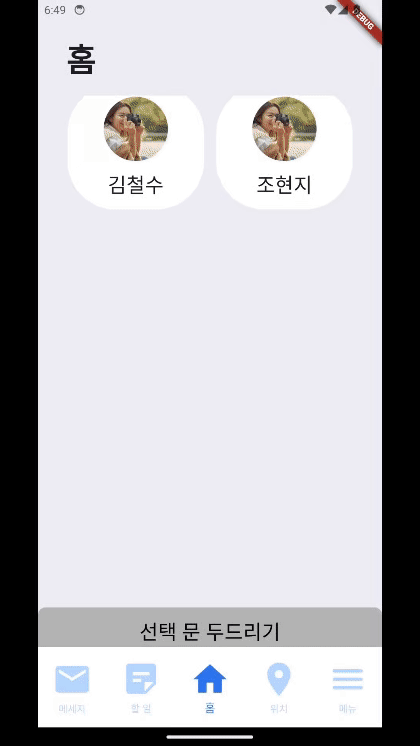
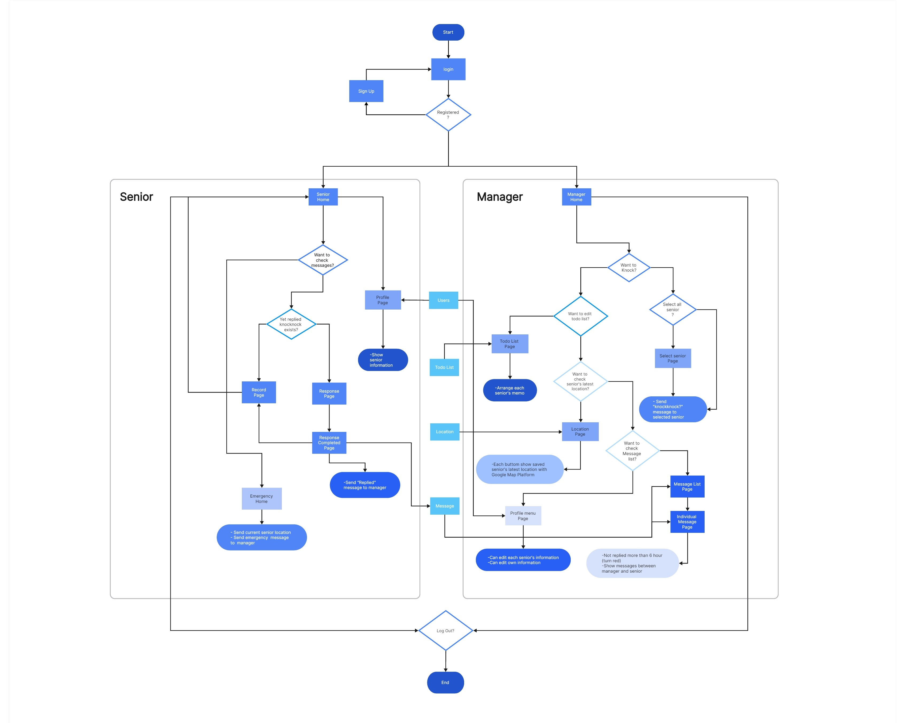

  <h1 align="center">🚪KNOCKKNOCK!🚪</h1>
  <strong>
    KnockKnock is a simple communication app that connects caregivers and elderly people who live alone.
  </strong>

 

## 🎙️Introduction
The elderly and caregivers can communicate with one another with just a few touches. In addition, caregivers can easily manage their communication history and daily schedule through KnockKnock.

  

Our team focused on the aging problem, which is a social problem in Korea. Along with the increase in the number of the elderly, the number of elderly people living alone is also increasing. As a result, the number of elderly people that a caregiver has to take care of is inevitably increasing. We tried to develop an application to solve this problem, and the app that was born in that way is 'knockknock'.
 
 

## 🥅 Goals & Targets
### Goals

- Sustainable Cities and Communities
- Good Health and Wellbeing
- Industry, Innovation and Infrastructure

### Targets

- Senior citizens, etc. who are 65 years of age or older living alone or in need of care for their descendants, etc
- A person who performs a management role, such as a dedicated social welfare worker, life support worker, volunteer, etc
 

## 💼 Main Functions
<ol>
  <li>
    <strong>Knocking on the Door: Communication Function between Elderly and Caregivers</strong> 
	Caregivers can use the 'knock on the door' event when they are curious about how the elderly are doing. 
  </li> 
  <li>
    <strong>Emergency help request function for the elderly</strong> 
	  If the elderly are in dangerous or urgent need of help, an ‘emergency call’ event can be used. 
  </li>  
  <li>
    <strong>Functions that make the work of a caregiver convenient: To-do list, saving profiles of senior citizens in charge, location tracking of the elderly</strong>  
	  'KnockKnock' offers several functions to make it easier for caregivers to work.
  </li>  

<table>
  <tr>
    <th>Function</th>
    <th>Detail</th>
  </tr>
  <tr>
    <td rowspan="2" align="center"><strong>Knocking</strong></td>
    <td>
      
    </td>
  </tr>
  <tr>
    <td> 
      The manager sends the elderly a text saying 'How are you?'. Then, the senior can reply to the most recently received text message. 
    </td>
  </tr>
  <tr>
    <td rowspan="2" align="center"><strong>Emergency</strong></td>
    <td>
      test
    </td>
  </tr>
  <tr>
    <td> 
      In an emergency, the elderly can send their real-time location information to the manager. 
    </td>
  </tr>
</table>
 
 
</ol>

## 📃 Detail
<table>
  <tr>
    <th>Function</th>
    <th>Detail</th>
  </tr>
  <tr>
    <td rowspan="2" align="center"> <strong>Message Record</strong> </td>
    <td>
      test
    </td>
  </tr>
  <tr>
    <td> 
      Seniors and managers can view the message records. If the manager hasn't received a reply after more than 6 hours, an alert window will appear on the manager's side. 
    </td>
  </tr>
  <tr>
    <td rowspan="2" align="center"> <strong>To-do List</strong> </td>
    <td>
      test
    </td>
  </tr>
  <tr>
    <td> 
      Managers can create to-do lists for the elderly under their care. 
    </td>
  </tr>
  <tr>
    <td rowspan="2" align="center"> <strong>Location Tracking</strong> </td>
    <td>
      test
    </td>
  </tr>
  <tr>
    <td> 
      While the app is running, the location of the elderly is recorded at regular intervals. Then, the administrator can check the location of the elderly based on the stored location data. 
    </td>
  </tr>
  <tr>
    <td rowspan="2" align="center"> <strong>Profile Editing</strong> </td>
    <td>
      test
    </td>
  </tr>
  <tr>
    <td> 
      The managers can change their profile and some of the profile information of the elderly. Seniors can only view their profile information. 
    </td>
  </tr>
</table>
 
 

## 📋 Flowchart

  

 

## 👟 How To Run Code
<ol>
  <li>
    First, please accept the code of GitHub as a zip file and decompress it.
  </li> 
  <li>
    We developed the application using flutter. If you don't have flutter installed, please install it.
  </li> 
  <li>
    Since our project utilizes the function of firebase, please execute the following command at the terminal of the project document location. 
	  
	  flutter pub add firebase_core
	  flutter pub add firebase_auth
	  flutter pub add cloud_firestore

If an error occurs, please enter the following command at the terminal. 
  
	  flutter pub upgrade

  </li> 
   <li>
	Execute the code. 
	   The best recommendation to run is to use the emulator. As we designed the UI to match with iPhone 14 Pro, we recommend running the emulator with the iPhone 14 Pro. 
	   If there is a problem with running the emulator, you can check it by running code in Chrome.
   </li>
</ol>
 
 

## 🔧 Tools
- <strong>Design</strong> 

- <strong>Environment</strong> 
	
	
- <strong>Development</strong> 

- <strong>Communication</strong> 

 
 

## 👥 Team
| Gil Jeongsu | Shim Minseo | Yang Yehyeon | Cho Hyunji |
|-------------|-------------|--------------|------------|
| 
Design  Frontend
 | 
Design  Frontend
 | 
Design  Backend
 | 
Design  Backend
|
 
 
